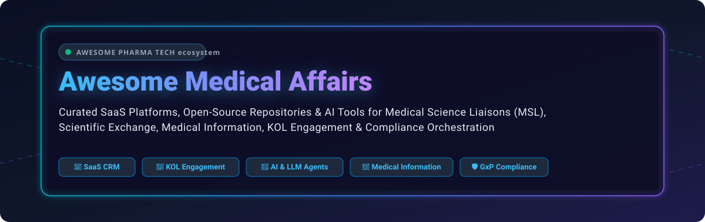

# 🩺 Awesome Medical Affairs

  
  
  
  
  
  

## 📌 Executive Overview & Market Context

Welcome to **Awesome Medical Affairs**, a curated knowledge directory and software ecosystem for pharmaceutical and life-sciences Medical Affairs teams, Medical Science Liaisons (MSLs), Medical Information specialists, and Healthcare Professionals (HCPs). 

This guide tracks leading enterprise **SaaS platforms** and **open-source GitHub repositories** powering key opinion leader (KOL) management, scientific exchange, publication intelligence, medical content review, GxP-compliant interaction workflows, and AI copilots.

---

## 📑 Table of Contents

- [📊 Sector Dynamics & Market Size](#-sector-dynamics--market-size)
- [💼 SaaS & Commercial Platforms](#-saas--commercial-platforms)
- [🔓 Open-Source GitHub Repositories](#-open-source-github-repositories)
- [🤝 How to Contribute](#-how-to-contribute)
- [🛡️ Compliance & Regulatory Disclaimer](#-compliance--regulatory-disclaimer)
- [☕ Support & Sponsorship](#-support--sponsorship)
- [📈 Star History](#-star-history)

---

## 📊 Sector Dynamics & Market Size

> 📈 **Estimated Sector Market Size**: The Global Medical Affairs Solutions & Scientific Engagement market is estimated at **$2.85 Billion in 2025** and projected to reach **$5.40 Billion by 2030** (CAGR of ~13.6%). 
> 
> 🏗️ **Market Structure & Fragmentation**: The core enterprise GxP-compliant Medical CRM segment is **highly concentrated (winner-take-all dynamics)** dominated by legacy enterprise platforms like IQVIA and Veeva Systems. Conversely, peripheral innovation niches—such as virtual advisory boards, biomedical AI copilots, and publication intelligence—remain **moderately fragmented**.

---

## 💼 SaaS & Commercial Platforms

The table below lists top enterprise Medical Affairs SaaS platforms, sorted by **Company Size / Revenue / Valuation** in descending order.

| Platform / Company | Company Size / Revenue / Valuation | Key Medical Affairs Capabilities | Specific Starting Pricing | Specific Free Tier / Free Trial Limits |
| :--- | :--- | :--- | :--- | :--- |
| 🏢 **[IQVIA OCE (Orchestrated Customer Engagement)](https://www.iqvia.com/)** | **$15.4B Revenue / $42.5B Market Cap** (~79,000 employees) | Life-sciences customer orchestration, HCP scientific engagement, insights analytics, and next-best-action workflows. | **$180 / user / month** (Starting enterprise user license) | **14-Day Enterprise Sandbox Trial** (5 test seats & sample database access) |
| 🛡️ **[Veeva Medical CRM / Vault Medical](https://www.veeva.com/)** | **$2.5B Revenue / $34.2B Market Cap** (~7,000 employees) | Industry-standard pharma CRM & Vault content management, MSL field interaction logging, medical info requests (MIR). | **$250 / user / month** ($3,000/user/year entry quote for Vault Medical) | **30-Day Guided Enterprise Sandbox** (3 MSL admin licenses for evaluation) |
| 🩺 **[Medscape Consult & Networks](https://www.medscape.com/)** | **$1.8B Revenue / $12.0B KKR Valuation** (~4,500 employees) | Peer-to-peer scientific discussion, HCP panel surveys, digital scientific exchange monitoring, and brand insights. | **$5,000 / month** (Starting brand insights & portal subscription) | **Free Forever Account for Verified HCPs & MSLs** (Unlimited peer search & post access) |
| 🔬 **[Indegene NEXT & Digital](https://www.indegene.com/)** | **$310M Revenue / $1.4B Market Cap** (~5,500 employees) | Omnichannel medical content, virtual congresses, medical communications, and automated MLR approval workflows. | **$2,500 / month** (Starting content & scientific engagement module) | **14-Day Self-Guided Interactive Demo** (Pre-loaded workflow sandbox) |
| 💡 **[Within3 Insights Platform](https://www.within3.com/)** | **$85M Revenue / $450M Valuation** (~350 employees) | Asynchronous virtual advisory boards, scientific communication mapping, KOL sentiment analysis, and transcript NLP. | **$1,200 / advisory session** or **$15,000 / year** baseline | **30-Day Trial Portal Access** (1 active virtual advisory board trial with up to 10 participants) |
| 🧠 **[Aktana Contextual Intelligence](https://www.aktana.com/)** | **$65M Revenue / $350M Valuation** (~300 employees) | AI-driven next-best-action copilot connecting scientific strategy to field MSL suggestions and CRM execution. | **$120 / user / month** (Field medical intelligence module) | **30-Day Guided Proof-of-Concept Sandbox** (Up to 10 MSL trial accounts) |
| 🧪 **[Medable Medical Affairs](https://www.medable.com/)** | **$55M Revenue / $2.1B Valuation** (~400 employees) | Real-world evidence (RWE) generation, decentralized study workflows, and MSL trial participant engagement. | **$10,000 / study / month** (Baseline evidence collection license) | **30-Day Trial Developer & Sandbox Access** (Simulated patient & MSL data workflows) |
| 📊 **[Agnitio (Indegene)](https://www.agnitio.com/)** | **$25M Revenue / $120M Valuation** (~150 employees) | Compliant e-detailing authoring, medical presentation tools, and interactive MSL engagement metrics. | **$45 / user / month** (Starting e-detailer authoring license) | **14-Day Free Trial** (Full access to e-detailing authoring tool & 5 active publishing links) |

---

## 🔓 Open-Source GitHub Repositories

Open-source activity provides modular building blocks for AI copilots, literature monitoring, clinical trial parsing, and GxP process automation. Below is a curated list sorted by **GitHub Stars_Count** in descending order.

| Repository & Link | Stars_Badge | Description & Capabilities in Medical Affairs |
| :--- | :--- | :--- |
| 🧬 **[microsoft/BioGPT](https://github.com/microsoft/BioGPT)** |  | Domain-specific generative Transformer language model trained on biomedical literature for scientific question answering, medical summary drafting, and literature intelligence. |
| 🧠 **[epfLLM/meditron](https://github.com/epfLLM/meditron)** |  | Open-source suite of large medical language models (7B and 70B parameters) adapted for clinical reasoning, literature synthesis, and Medical Affairs copilot applications. |
| 🔍 **[allenai/scispacy](https://github.com/allenai/scispacy)** |  | Python package for biomedical Named Entity Recognition (NER), UMLS entity linking, and literature text processing for publication monitoring systems. |
| 📋 **[facebookresearch/Clinical-Trial-Parser](https://github.com/facebookresearch/Clinical-Trial-Parser)** |  | NLP library and model for converting unstructured clinical trial eligibility criteria into machine-readable formats for Medical Affairs protocol matching. |
| 🎯 **[futianfan/clinical-trial-outcome-prediction](https://github.com/futianfan/clinical-trial-outcome-prediction)** |  | Deep learning framework (HINT) and benchmark dataset for predicting clinical trial outcomes and approval probabilities based on protocol and drug structures. |
| 🧪 **[BioMistral/BioMistral](https://github.com/BioMistral/BioMistral)** |  | Open-source LLM specialized for medical question answering and clinical text generation, fine-tuned on Mistral-7B with medical benchmarks. |
| 🤖 **[appsilon/mediforce](https://github.com/appsilon/mediforce)** |  | Open-source platform for orchestrating AI agents and human workflows in pharma, designed with compliance, auditability, and GxP-oriented oversight in mind. |
| 🔬 **[ds4cabs/DS4MedAffairs](https://github.com/ds4cabs/DS4MedAffairs)** |  | Open-source project focused on AI capabilities for Medical Affairs—publication intelligence, congress summarization, MSL copilots, and KOL workflow tools. |

---

## 🤝 How to Contribute

Contributions are warmly welcome! Please follow these simple steps:

1. 🍴 **Fork the repository**.
2. 📝 **Add or edit entries** in `README.md` maintaining the existing table formatting.
3. 🔎 **Provide accurate data**: Platform name, verified link, pricing/free trial limits, company size/valuation, or GitHub star links.
4. 📥 **Submit a Pull Request** with a brief summary of additions.

---

## 🛡️ Compliance & Regulatory Disclaimer

- ⚠️ **Community Resource**: This repository is a community-curated directory for informational and educational purposes only.
- 🔒 **Regulatory Requirements**: Medical Affairs operations are subject to strict regulatory oversight (FDA, EMA, GxP, HIPAA, Sunshine Act). Systems handling medical communications, MIRs, or HCP interactions must enforce strict separation from commercial promotion, role-based audit trails, and compliance validation.
- ⚡ **Open-Source Notice**: Open-source tools provide architectural building blocks but generally do not include validated compliance frameworks out of the box. Deployments in regulated life-sciences environments require rigorous validation and legal sign-off.

---

## ☕ Support & Sponsorship

Thank you for visiting **Awesome Medical Affairs**! If you find this resource valuable, please consider giving it a ⭐ **Star**, sharing it with your network, or supporting ongoing maintenance.

- ⭐ **Star the repo**: Click the star button at the top right of this page.
- 🍴 **Fork the repo**: Help expand our dataset with new SaaS and open-source tools.
- ☕ **Sponsor the Maintainer**: Buy me a coffee via the [GitHub Sponsor Dashboard](https://github.com/sponsors/ishandutta2007).

  

---

## 📈 Star History

---

  <i>Maintained with ❤️ for Medical Affairs leaders, MSLs, Medical Information teams, and Life Sciences technologists worldwide.</i>

